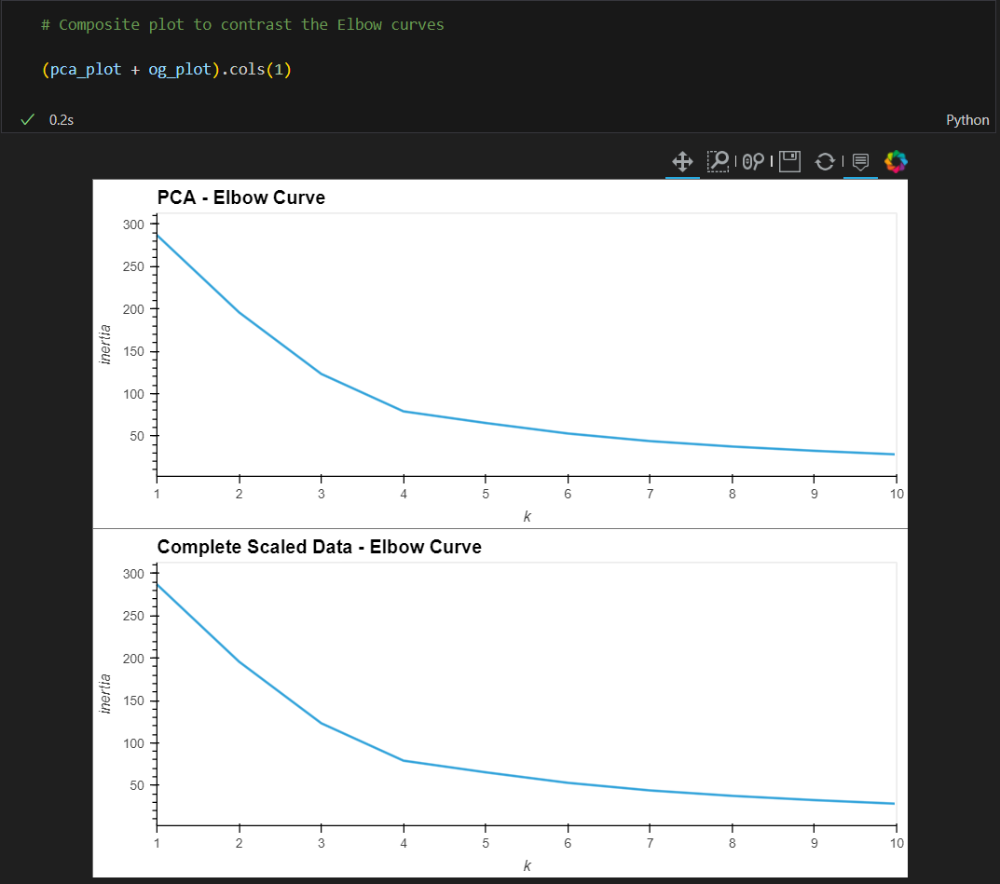
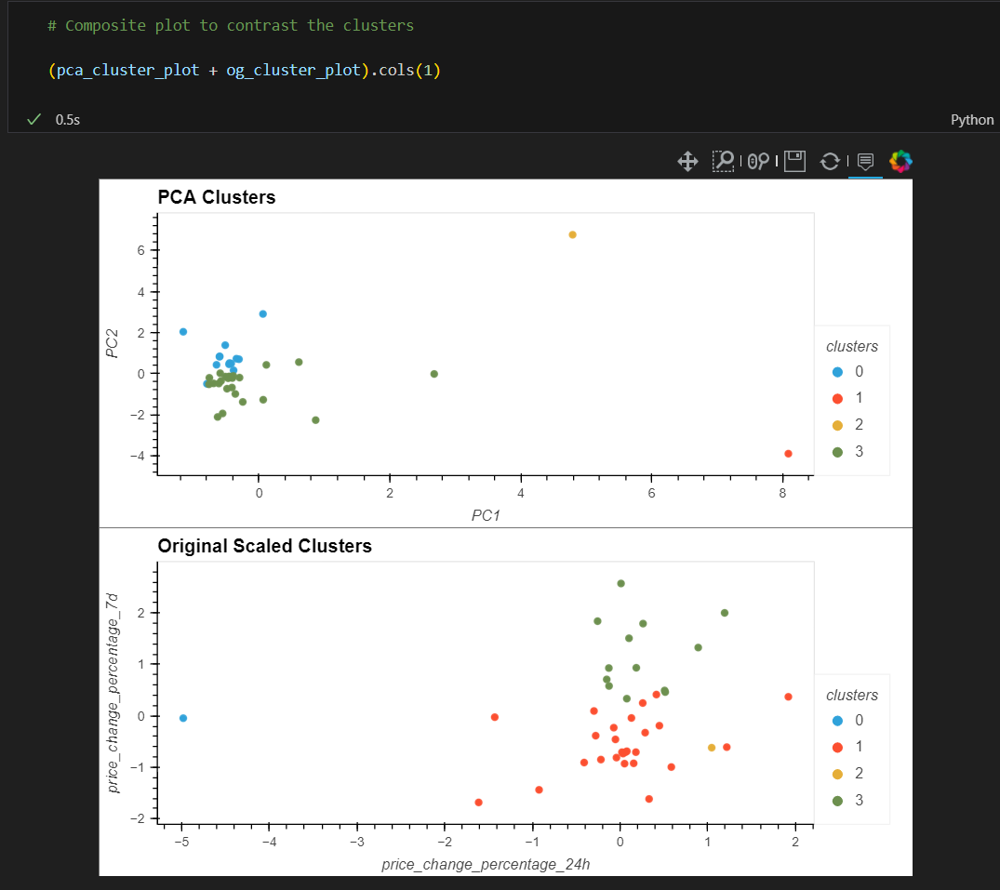

# CryptoClustering
Challenge 19 - CryptoClustering

## Challenge Description

This challenge is about clustering a set of cryptocurrencies by their performance in different time periods. The goal is to find out which cryptocurrencies are most similar to each other and group them together. The data set contains the historical performance of 41 different cryptocurrencies. The data set is provided in the file `crypto_market_data.csv`. The data set contains the following columns:

* `symbol`: The symbol of the cryptocurrency
* `price change over 24 hours`: The price change of the cryptocurrency over the last 24 hours
* `price change over 7 days`: The price chagne of the cryptocurrency on that week
* `price change over 14 days`: The price change of the cryptocurrency over the last 14 days
* `price change over 30 days`: The price change of the cryptocurrency over the last 30 days
* `price change over 60 days`: The price change of the cryptocurrency over the last 60 days
* `price change over 200 days`: The price change of the cryptocurrency over the last 200 days
* `price change over 1 year`: The price change of the cryptocurrency over the last year

## Challenge Tasks

### Part 1: Analyze the original data set
1. Load the data set into a pandas DataFrame
2. Normalize the data set using StandardScaler module from sklearn
3. Use the elbow method to find the optimal number of clusters
4. Cluster the data set using KMeans
5. Visualize the clusters of the scaled data using a scatter plot

### Part 2: Analyze the PCA data set
1. Use PCA to reduce the dimensionality of the data set to 3 dimensions
2. Determine the explained variance of the PCA data set
3. Repeat the KMeans elbow method with the PCA data to find the optimal number of cluster and plot the results
4. Build the new datafram with the cluster data
5. Visualize the PCA clusters using a scatter plot
6. Compare the results of the original data set and the PCA data set

### Plots

 1.  ### KMeans Elbow Plots 

2.   ### Cluster Plots

